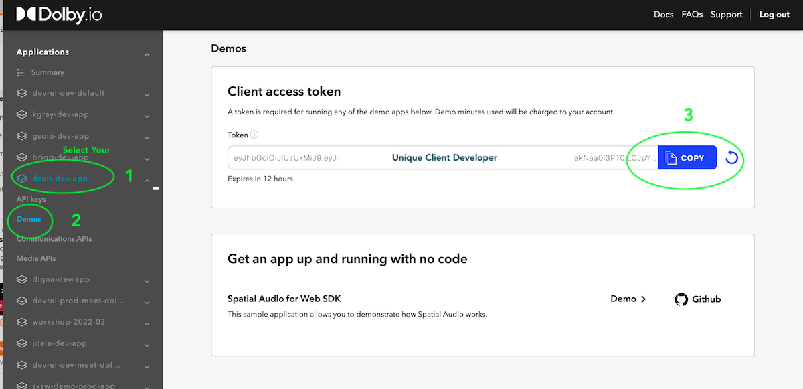

# Communications APIs Quick Start Application

## About this Quick Start Application Workshop (v quickstart)
 
This example is targeted for rapid deployment with just a developer token. The example contains a front-end application and uses a client token authenticate with the Dolby.io API. 

For the purposes of running this application, you'll need to sign-up to following platforms:
- [Dolby.io](https://dolby.io/signup)

The application works across all the majory browsers, however we recommend using Chrome to take advantage of additional features offered by the browser. 

## Run the app
Create a project directory, open your code editor and run your terminal with the git clone command to download the project. We've created a simple web app example contained within the www folder of this project.  This quick example uses a node.js script to create a simple express server to web serve the application. It's an optional script, feel free to host the www/index.html file with VS code's live server or other server in your own tool chain.

```Shell
git clone https://github.com/dolbyio-samples/comms-sdk-web-quickstart.git

cd comms-sdk-web-quickstart

npm install

npm run start

```
The start script will run the server.js file and create a localhost server on PORT 9000. You should see the following in your terminal when the express server starts. 

```shell

> comms-sdk-web-quickstart@1.1.0 start
> node server.js

Server up and running on  http://localhost:9000/
```

 Navigate your web browser to http://localhost:9000/ and you should see the app running with a dialog prompting for a CONSUMER KEY and SECRET.  Copy these keys from the dolby.io [Dashboard](https://dashboard.dolby.io), found by creating new app or selecting an existing one and clicking the key's icon.  

The dialog will authenticate the SDK and you'll be able to make a Dolby.io Video Conference call.  Congratulations!

***If you run into errors with starting the server, try stopping other instances using port 9000 or changing line 6 in server.js to a different port number.***

Entering in a key ans secret each time you run the app isn't that convenient. 
Let's switch the authentication to using a client access token instead. 

## Find your developer token:
 - Just login to our dashboard, select your application, click demos and copy the unique token.



 - Open **www/scripts/constants.js** file and replace the **apiToken** value with the developer token you just copied.

Now you can run your app over and over, and even share the app with others to try it out.  The app will run until that token expires, in about 12 hours. 
To fully secure your app for production, we suggest creating a token server to handle the authentication.  We've provided a [more complete application](https://github.com/dolbyio-samples/comms-sdk-web-quickstart/tree/complete-netlify-deploy) example using a token server and deploying to Netlify, that code is in this repo on the complete-netlify-deploy example branch.